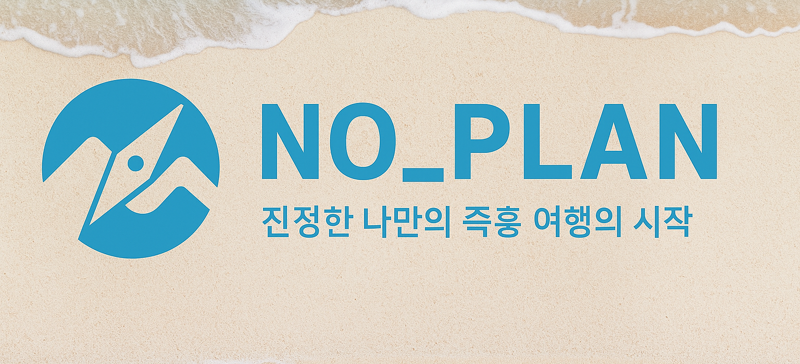
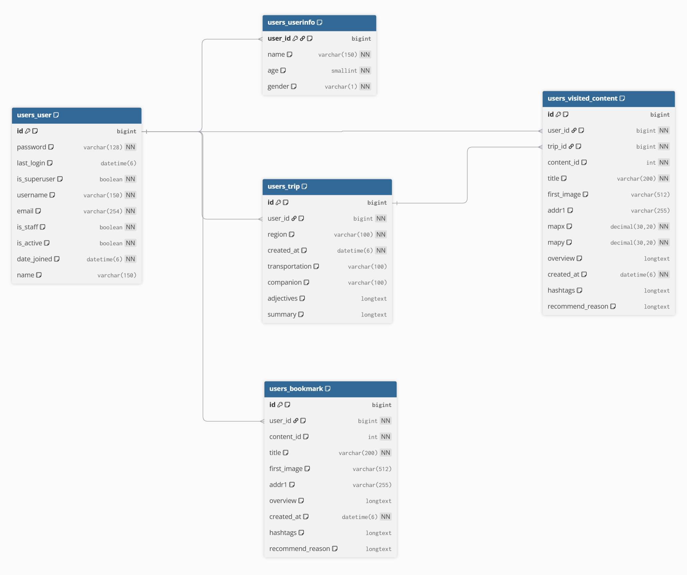

# NO_PLAN - AI 기반 개인 맞춤 여행지 추천 API



**NO_PLAN**은 사용자의 실시간 위치와 추상적인 취향(분위기, 테마 등)을 바탕으로 주변 장소를 추천하고, 여행 일정을 관리할 수 있도록 돕는 인공지능 기반 API 서버입니다. "계획 없이 떠나는 여행"을 컨셉으로, 즉흥적인 사용자에게 최적의 장소를 제안합니다.

---

## 🌟 주요 기능

- **AI 기반 맞춤 추천**:
  - 사용자가 "분위기 있는", "힙한" 등 **형용사**로 원하는 장소의 분위기를 표현하면, AI가 블로그 리뷰를 분석하여 가장 적합한 장소를 추천합니다.
  - OpenAI의 **임베딩(Embedding)** 모델과 **코사인 유사도**를 활용하여 사용자의 취향과 장소의 특징을 매칭합니다.
  - **GPT** 모델을 통해 각 장소에 대한 **맞춤 추천 이유**와 **핵심 해시태그**를 동적으로 생성하여 제공합니다.

- **실시간 위치 기반 검색**:
  - 사용자의 현재 위치(좌표)를 기반으로 주변의 **식당, 카페, 관광지, 숙소** 목록을 실시간으로 조회합니다.
  - 한국관광공사의 TourAPI를 활용하여 신뢰도 높은 장소 정보를 제공합니다.

- **AI 여행 요약 생성**:
  - 사용자가 기록한 여행의 동행자, 이동수단, 방문 장소 목록 및 특징을 바탕으로 AI가 **종합적인 여행 후기**를 생성합니다.

- **사용자 인증 및 데이터 관리**:
  - 이메일/비밀번호 기반의 일반 회원가입 및 로그인 기능을 제공합니다.
  - **카카오 소셜 로그인**을 지원하여 간편하게 서비스를 이용할 수 있습니다.
  - JWT(JSON Web Token)를 사용한 상태 비저장(Stateless) 인증 방식을 채택했습니다.

- **개인화된 여행 관리**:
  - 사용자는 자신만의 **'여행(Trip)'**을 생성하고 관리할 수 있습니다.
  - AI가 추천해준 장소를 **'방문한 장소'** 또는 **'북마크'**로 저장하여 나만의 여행 기록을 만들 수 있습니다.

---

## 🏗️ 시스템 아키텍처

NO_PLAN은 명확한 역할 분리를 통해 유지보수성과 확장성을 높인 3-Tier 아키텍처로 구성되어 있습니다.



- **`users` (인증 및 데이터 관리)**:
  - **역할**: 프로젝트의 백본. 사용자 정보, 여행, 방문 기록, 북마크 등 모든 핵심 데이터를 관리하고 DB에 저장합니다.
  - **기술**: Django-Rest-Framework, dj-rest-auth, allauth, Simple-JWT

- **`tour_api` (API 게이트웨이 및 오케스트레이터)**:
  - **역할**: 클라이언트의 요청을 받는 API 엔드포인트. 외부 API(한국관광공사)와 내부 AI 모듈을 조율하여 최종 결과를 생성합니다. 비동기 처리를 통해 응답 속도를 최적화합니다.
  - **기술**: Django (AsyncAPIView), aiohttp, REST Framework

- **`ai` (AI 엔진)**:
  - **역할**: 프로젝트의 두뇌. 웹 크롤링, 자연어 처리, AI 모델(OpenAI) 호출 등 핵심 AI 로직을 수행합니다.
  - **기술**: OpenAI API, Scikit-learn, BeautifulSoup, aiohttp, Pandas

---

## 🛠️ 기술 스택

- **Backend**: Django, Django Rest Framework
- **Asynchronous**: aiohttp, asyncio
- **Database**: MySQL
- **AI & NLP**: OpenAI (GPT, Embedding), Scikit-learn, Tiktoken
- **Web Crawling**: BeautifulSoup, aiohttp
- **Authentication**: dj-rest-auth, allauth, rest-framework-simplejwt
- **Environment Management**: python-dotenv

---

## 🚀 시작하기

### 1. 사전 요구사항

- Python 3.12+
- MySQL Server
- Git
- Microsoft Build Tools (Windows 사용자의 경우)

### 2. 프로젝트 클론 및 설정

```bash
# 1. 프로젝트를 클론합니다.
git clone https://github.com/your-username/no-plan.git
cd no-plan

# 2. 가상환경을 생성하고 활성화합니다.
python -m venv .venv
source .venv/bin/activate  # macOS/Linux
# .venv\Scripts\activate    # Windows

# 3. 필요한 패키지를 설치합니다.
pip install -r requirements.txt
```

### 3. 환경 변수 설정

프로젝트 루트 디렉토리에 `.env` 파일을 생성하고 아래 내용을 채워주세요.

```env
# Django
DJANGO_SECRET_KEY='your-django-secret-key'
ALLOWED_HOSTS='127.0.0.1,localhost'

# Database
DB_NAME='your-db-name'
DB_USER='your-db-user'
DB_PASSWORD='your-db-password'
DB_HOST='127.0.0.1'
DB_PORT='3306'

# API Keys
TOUR_API_SERVICE_KEY='your-tour-api-key'
KAKAO_API_KEY='your-kakao-rest-api-key'
DAUM_API_KEY='your-kakao-rest-api-key-for-search'
OPENAI_API_KEY='your-openai-api-key'
```

### 4. 데이터베이스 마이그레이션

```bash
python manage.py migrate
```

### 5. 서버 실행

```bash
python manage.py runserver
```

이제 `http://127.0.0.1:8000` 주소로 서버에 접속할 수 있습니다.

---

## 📖 주요 API 엔드포인트

-   **Base URL**: `/api/v1/`

### 사용자 및 인증 (`/users/`)

| Method | URL | 설명 | 인증 필요 |
| :--- | :--- | :--- | :---: |
| POST | `/register/` | 이메일 회원가입 | ❌ |
| POST | `/login/` | 이메일 로그인 | ❌ |
| GET | `/kakao/` | 카카오 소셜 로그인 처리 | ❌ |
| POST | `/logout/` | 로그아웃 (Refresh Token 블랙리스트 처리) | ✅ |
| POST | `/token/refresh/` | Access Token 재발급 | ✅ |
| GET | `/me/` | 내 정보 조회 | ✅ |
| PUT / PATCH | `/set_name/` | 내 이름 설정/변경 | ✅ |
| POST | `/password/change/` | 비밀번호 변경 | ✅ |
| DELETE | `/me/withdraw/` | 회원 탈퇴 | ✅ |
| GET, POST, PUT, PATCH | `/me/info/` | 추가 정보(나이,성별) CRUD | ✅ |
| GET | `/find-region/` | 좌표로 지역명 변환 | ❌ |

### 여행 및 데이터 (`/users/`)

| Method | URL | 설명 | 인증 필요 |
| :--- | :--- | :--- | :---: |
| GET / POST | `/trips/` | 내 여행 목록 조회 / 새 여행 생성 | ✅ |
| GET / POST | `/visited-contents/` | 방문 장소 목록 조회 / 방문 장소 저장 | ✅ |
| GET / POST | `/bookmarks/` | 북마크 목록 조회 / 북마크 추가 | ✅ |
| DELETE | `/bookmarks/<int:pk>/` | 특정 북마크 삭제 | ✅ |

### 장소 추천 및 요약 (`/tours/`)

| Method | URL | 설명 | 인증 필요 |
| :--- | :--- | :--- | :---: |
| GET | `/restaurants/` | 주변 식당 추천 (AI 또는 거리순) | ❌ |
| GET | `/cafes/` | 주변 카페 추천 (AI 또는 거리순) | ❌ |
| GET | `/attractions/` | 주변 관광지 추천 (AI 또는 거리순) | ❌ |
| GET | `/accommodations/`| 주변 숙소 추천 (AI 또는 거리순) | ❌ |
| GET | `/detail/<int:content_id>/` | 특정 장소 상세 정보 조회 | ❌ |
| POST | `/trips/<int:trip_id>/summarize/` | AI 여행 요약 생성 | ✅ |


---

## 💻 API 호출 예시

> **참고**: 인증이 필요한 API는 HTTP 요청 헤더에 `Authorization: Bearer <ACCESS_TOKEN>` 을 포함해야 합니다.

### 1. 회원가입
`POST /api/v1/users/register/`
```json
// Request Body
{
    "email": "tester@example.com",
    "password": "password123",
    "password2": "password123"
}
```
```json
// Response (Success 201 Created)
{
    "email": "tester@example.com"
}
```

### 2. 일반 로그인
`POST /api/v1/users/login/`
```json
// Request Body
{
    "email": "tester@example.com",
    "password": "password123"
}
```
```json
// Response (Success 200 OK)
{
    "user": {
        "id": 15,
        "name": null,
        "email": "tester@example.com",
        "is_info_exist": false
    },
    "access": "eyJhbGciOiJIUzI1NiIsInR5cCI6IkpXVCJ9...",
    "refresh": "eyJhbGciOiJIUzI1NiIsInR5cCI6IkpXVCJ9...",
    "is_info_exist": false
}
```

### 3. 소셜 로그인 (카카오)
`GET /api/v1/users/kakao/?code=<KAKAO_AUTHORIZATION_CODE>`

> **Note**: 이 API는 Postman으로 직접 테스트하기 어렵습니다. 클라이언트에서 카카오 로그인을 통해 얻은 **인가 코드(code)**를 쿼리 파라미터로 포함하여 브라우저에서 리다이렉션되어야 정상적으로 동작합니다.

```json
// Response (Success 200 OK)
{
    "user": {
        "id": 16,
        "name": "김노플랜",
        "email": "noplan@kakao.com",
        "is_info_exist": false
    },
    "access": "eyJhbGciOiJIUzI1NiIsInR5cCI6IkpXVCJ9...",
    "refresh": "eyJhbGciOiJIUzI1NiIsInR5cCI6IkpXVCJ9...",
    "is_info_exist": false
}
```

### 4. 로그아웃
`POST /api/v1/users/logout/`
```http
// Request Headers
Authorization: Bearer <ACCESS_TOKEN>
```
```json
// Request Body
{
    "refresh": "<REFRESH_TOKEN>"
}
```
```text
// Response (Success 205 Reset Content)
// No body content
```

### 5. 비밀번호 변경
`POST /api/v1/users/password/change/`
```http
// Request Headers
Authorization: Bearer <ACCESS_TOKEN>
```
```json
// Request Body
{
    "old_password": "password123",
    "new_password1": "new_password456",
    "new_password2": "new_password456"
}
```
```json
// Response (Success 200 OK)
{
    "detail": "비밀번호가 성공적으로 변경되었습니다."
}
```

### 6. Access Token 재발급
`POST /api/v1/users/token/refresh/`
```http
// Request Headers
Authorization: Bearer <REFRESH_TOKEN>
```
```json
// Request Body
{
    "refresh": "<REFRESH_TOKEN>"
}
```
```json
// Response (Success 200 OK)
{
    "access": "eyJhbGciOiJIUzI1NiIsInR5cCI6IkpXVCJ9..."
}
```

### 7. 내 정보 조회
`GET /api/v1/users/me/`
```http
// Request Headers
Authorization: Bearer <ACCESS_TOKEN>
```
```json
// Response (Success 200 OK)
{
    "id": 15,
    "name": "김노플랜",
    "email": "tester@example.com",
    "is_info_exist": true
}
```

### 8. 이름/나이/성별 등록 (최초 1회)
`POST /api/v1/users/me/info/`
```http
// Request Headers
Authorization: Bearer <ACCESS_TOKEN>
```
```json
// Request Body
{
    "name": "김노플랜",
    "age": 25,
    "gender": "M"
}
```
```json
// Response (Success 201 Created)
{
    "name": "김노플랜",
    "age": 25,
    "gender": "M"
}
```

### 9. 이름/나이/성별 변경
`PATCH /api/v1/users/me/info/`
```http
// Request Headers
Authorization: Bearer <ACCESS_TOKEN>
```
```json
// Request Body (바꾸고 싶은 부분만 작성)
{
    "age": 26
}
```
```json
// Response (Success 200 OK)
{
    "name": "김노플랜",
    "age": 26,
    "gender": "M"
}
```

### 10. 회원 탈퇴
`DELETE /api/v1/users/me/withdraw/`
```http
// Request Headers
Authorization: Bearer <ACCESS_TOKEN>
```
```json
// Response (Success 200 OK)
{
    "detail": "회원탈퇴가 성공적으로 처리되었습니다."
}
```

### 11. 여행 생성
`POST /api/v1/users/trips/`
```http
// Request Headers
Authorization: Bearer <ACCESS_TOKEN>
```
```json
// Request Body
{
    "region": "서울",
    "transportation": "대중교통",
    "companion": "친구",
    "adjectives": "안락한,산뜻한,정겨운"
}
```
```json
// Response (Success 201 Created)
{
    "id": 84,
    "user": "tester@example.com",
    "region": "서울",
    "created_at": "2025-08-09T09:57:39.093108Z",
    "transportation": "대중교통",
    "companion": "친구",
    "adjectives": "안락한,산뜻한,정겨운",
    "summary": null
}
```

### 12. 내 여행 목록 조회
`GET /api/v1/users/trips/`
```http
// Request Headers
Authorization: Bearer <ACCESS_TOKEN>
```
```json
// Response (Success 200 OK)
[
    {
        "id": 83,
        "user": "tester@example.com",
        "region": "서울",
        // ...
    },
    {
        "id": 82,
        "user": "tester@example.com",
        "region": "경기",
        // ...
    }
]
```

### 13. 방문한 장소 저장
`POST /api/v1/users/visited-contents/`
```http
// Request Headers
Authorization: Bearer <ACCESS_TOKEN>
```
```json
// Request Body
{
    "content_id": 2642931,
    "title": "장안문",
    "first_image": "http://tong.visitkorea.or.kr/...",
    "addr1": "서울특별시 중구 을지로3길 29",
    "mapx": "126.9813651797",
    "mapy": "37.5674097516",
    "overview": "...",
    "hashtags": "#포차 #빈티지감성",
    "recommend_reason": "장안문은 빈티지하면서도 세련된 인테리어...",
    "category": "식당"
}
```

### 14. 방문한 장소 목록 조회
`GET /api/v1/users/visited-contents/`
```http
// Request Headers
Authorization: Bearer <ACCESS_TOKEN>
```

### 15. 북마크 추가
`POST /api/v1/users/bookmarks/`
```http
// Request Headers
Authorization: Bearer <ACCESS_TOKEN>
```
```json
// Request Body (visited-contents와 유사)
{
    "content_id": 2654055,
    "title": "손가명가",
    "first_image": "http://tong.visitkorea.or.kr/...",
    ...
}
```

### 16. 북마크 목록 조회
`GET /api/v1/users/bookmarks/`
```http
// Request Headers
Authorization: Bearer <ACCESS_TOKEN>
```

### 17. 북마크 삭제
`DELETE /api/v1/users/bookmarks/18/`
```http
// Request Headers
Authorization: Bearer <ACCESS_TOKEN>
```
```text
// Response (Success 204 No Content)
```

### 18. 위치 기반 장소 추천 (식당/카페/관광지/숙소)
`GET /api/v1/tours/restaurants/?mapX=126.9779&mapY=37.5665&radius=1000&adjectives=정겨운,산뜻한`
> `adjectives` 파라미터가 없으면 거리순으로 정렬된 결과가, 있으면 AI 추천 결과가 반환됩니다.

```json
// Response (Success 200 OK)
[
    {
        "contentid": "2642931",
        "title": "초류향",
        "dist": "324.18",
        "similarity": 0.2725,
        "recommend_reason": "초류향은 35년 전통의 중식당으로...",
        "hashtags": "#전통 #가성비 #깔끔",
        "populartimes": {
            "rating": 4.1,
            "rating_n": 761,
            "current_status": "not_busy",
            "busiest_time": { "day": "Wednesday", "hour": "12:00" }
        }
    }
]
```

### 19. 장소 상세 정보 조회
`GET /api/v1/tours/detail/2654055/`
```json
// Response (Success 200 OK)
{
    "contentid": "2654055",
    "contenttypeid": "39",
    "title": "손가명가",
    "overview": "회식으로 인기 있는 매장이다. 대표메뉴는 생고기 김치찌개이다...",
    ...
}
```

### 20. 여행 요약 생성기
`POST /api/v1/tours/trips/52/summarize/`
```http
// Request Headers
Authorization: Bearer <ACCESS_TOKEN>
```
```json
// Response (Success 200 OK)
{
    "trip_id": 52,
    "summary": "가족과 함께 경기 지역을 여행하며 따뜻한 일상과 소소한 즐거움을 만끽하셨군요. 맛집인 그집쭈꾸미볶음과 길림성에서 맛있는 시간을 보내고..."
}
```
