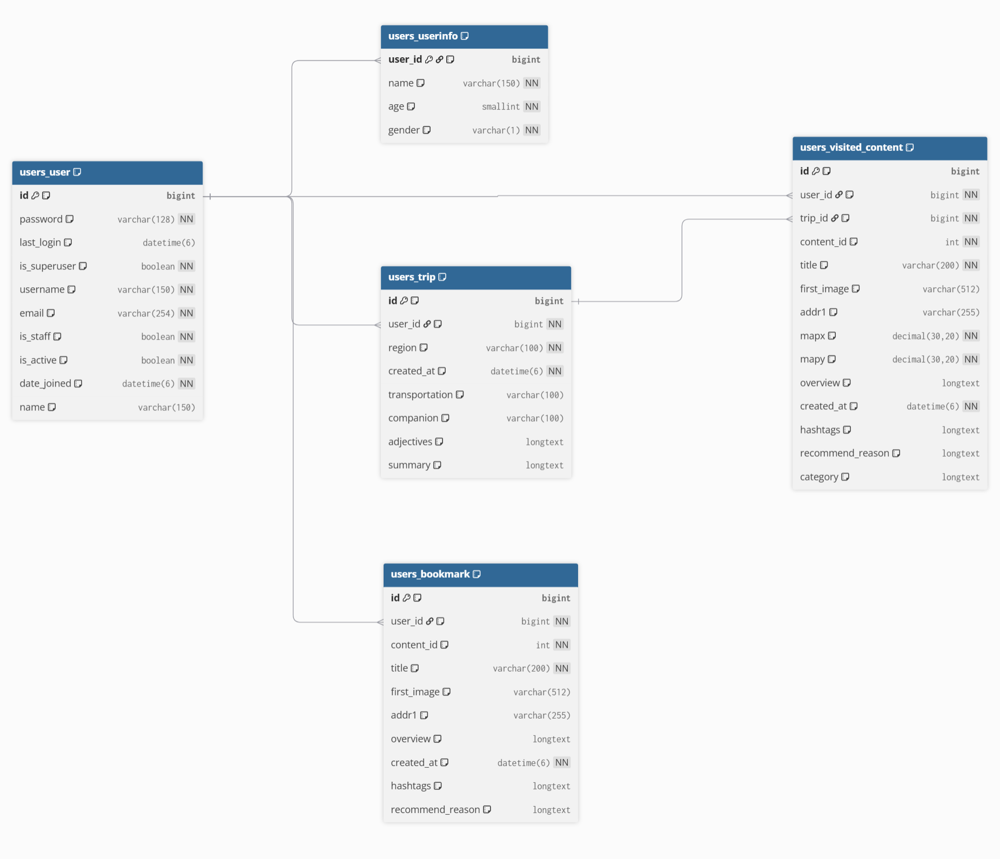

# NO_PLAN - AI 기반 개인 맞춤 여행지 추천 API


**NO_PLAN**은 사용자의 실시간 위치와 추상적인 취향(분위기, 테마 등)을 바탕으로 주변 장소를 추천하고, 여행 일정을 관리할 수 있도록 돕는 인공지능 기반 API 서버입니다. "계획 없이 떠나는 여행"을 컨셉으로, 즉흥적인 사용자에게 최적의 장소를 제안합니다.

---

## 🌟 주요 기능

- **AI 기반 맞춤 추천**:
  - 사용자가 "분위기 있는", "가성비 좋은" 등 **형용사**로 원하는 장소의 분위기를 표현하면, AI가 블로그 리뷰를 분석하여 가장 적합한 장소를 추천합니다.
  - OpenAI의 **임베딩(Embedding)** 모델과 **코사인 유사도**를 활용하여 사용자의 취향과 장소의 특징을 매칭합니다.
  - **GPT** 모델을 통해 각 장소에 대한 **맞춤 추천 이유**와 **핵심 해시태그**를 동적으로 생성하여 제공합니다.

- **실시간 위치 기반 검색**:
  - 사용자의 현재 위치(좌표)를 기반으로 주변의 **식당, 카페, 관광지, 숙소** 목록을 실시간으로 조회합니다.
  - 한국관광공사의 TourAPI를 활용하여 신뢰도 높은 장소 정보를 제공합니다.

- **사용자 인증 및 데이터 관리**:
  - 이메일/비밀번호 기반의 일반 회원가입 및 로그인 기능을 제공합니다.
  - **카카오 소셜 로그인**을 지원하여 간편하게 서비스를 이용할 수 있습니다.
  - JWT(JSON Web Token)를 사용한 상태 비저장(Stateless) 인증 방식을 채택했습니다.

- **개인화된 여행 관리**:
  - 사용자는 자신만의 **'여행(Trip)'**을 생성하고 관리할 수 있습니다.
  - AI가 추천해준 장소를 **'방문한 장소'** 또는 **'북마크'**로 저장하여 나만의 여행 기록을 만들 수 있습니다.

---

## 🏗️ 시스템 아키텍처

NO_PLAN은 명확한 역할 분리를 통해 유지보수성과 확장성을 높인 3-Tier 아키텍처로 구성되어 있습니다.



- **`users` (인증 및 데이터 관리)**:
  - **역할**: 프로젝트의 백본. 사용자 정보, 여행, 방문 기록, 북마크 등 모든 핵심 데이터를 관리하고 DB에 저장합니다.
  - **기술**: Django-Rest-Framework, dj-rest-auth, allauth, Simple-JWT

- **`tour_api` (API 게이트웨이 및 오케스트레이터)**:
  - **역할**: 클라이언트의 요청을 받는 API 엔드포인트. 외부 API(한국관광공사)와 내부 AI 모듈을 조율하여 최종 결과를 생성합니다. 비동기 처리를 통해 응답 속도를 최적화합니다.
  - **기술**: Django (AsyncAPIView), aiohttp, REST Framework

- **`ai` (AI 엔진)**:
  - **역할**: 프로젝트의 두뇌. 웹 크롤링, 자연어 처리, AI 모델(OpenAI) 호출 등 핵심 AI 로직을 수행합니다.
  - **기술**: OpenAI API, Scikit-learn, BeautifulSoup, aiohttp, Pandas

---

## 🛠️ 기술 스택

- **Backend**: Django, Django Rest Framework
- **Asynchronous**: aiohttp, asyncio
- **Database**: MySQL
- **AI & NLP**: OpenAI (GPT, Embedding), Scikit-learn, Tiktoken
- **Web Crawling**: BeautifulSoup, aiohttp
- **Authentication**: dj-rest-auth, allauth, rest-framework-simplejwt
- **Environment Management**: python-dotenv

---

## 🚀 시작하기

### 1. 사전 요구사항

- Python 3.10+
- MySQL Server
- Git

### 2. 프로젝트 클론 및 설정

```bash
# 1. 프로젝트를 클론합니다.
git clone https://github.com/your-username/no-plan.git
cd no-plan

# 2. 가상환경을 생성하고 활성화합니다.
python -m venv venv
source venv/bin/activate  # macOS/Linux
# venv\Scripts\activate    # Windows

# 3. 필요한 패키지를 설치합니다.
pip install -r requirements.txt
```

### 3. 환경 변수 설정

프로젝트 루트 디렉토리에 `.env` 파일을 생성하고 아래 내용을 채워주세요.

```env
# Django
DJANGO_SECRET_KEY='your-django-secret-key'
ALLOWED_HOSTS='127.0.0.1,localhost'

# Database
DB_NAME='your-db-name'
DB_USER='your-db-user'
DB_PASSWORD='your-db-password'
DB_HOST='127.0.0.1'
DB_PORT='3306'

# API Keys
TOUR_API_SERVICE_KEY='your-tour-api-key'
KAKAO_API_KEY='your-kakao-rest-api-key'
DAUM_API_KEY='your-kakao-rest-api-key-for-search'
OPENAI_API_KEY='your-openai-api-key'
```

### 4. 데이터베이스 마이그레이션

```bash
python manage.py migrate
```

### 5. 서버 실행

```bash
python manage.py runserver
```

이제 `http://127.0.0.1:8000` 주소로 서버에 접속할 수 있습니다.

---

## 📖 주요 API 엔드포인트

- **Base URL**: `/api/v1/`

### 사용자 (`/users/`)

| Method | URL                      | 설명                           | 인증 필요 |
| ------ | ------------------------ | ------------------------------ | --------- |
| POST   | `/register/`             | 이메일 회원가입                | ❌        |
| POST   | `/login/`                | 이메일 로그인                  | ❌        |
| POST   | `/logout/`               | 로그아웃                       | ✅        |
| GET    | `/kakao/`                | 카카오 소셜 로그인             | ❌        |
| GET    | `/me/`                   | 내 정보 조회                   | ✅        |
| POST   | `/me/info/`              | 내 추가 정보(나이,성별) 등록   | ✅        |
| GET    | `/trips/`                | 내 여행 목록 조회              | ✅        |
| POST   | `/trips/`                | 새 여행 생성                   | ✅        |
| GET    | `/bookmarks/`            | 내 북마크 목록 조회            | ✅        |
| POST   | `/bookmarks/`            | 북마크 추가                    | ✅        |
| DELETE | `/bookmarks/<int:pk>/`   | 북마크 삭제                    | ✅        |

### 여행지 추천 (`/tours/`)

| Method | URL                | 설명                                 | 인증 필요 |
| ------ | ------------------ | ------------------------------------ | --------- |
| GET    | `/restaurants/`    | 주변 식당 추천 (AI 또는 거리순)      | ❌        |
| GET    | `/cafes/`          | 주변 카페 추천 (AI 또는 거리순)      | ❌        |
| GET    | `/attractions/`    | 주변 관광지 추천 (AI 또는 거리순)    | ❌        |
| GET    | `/accommodations/` | 주변 숙소 추천 (AI 또는 거리순)      | ❌        |
| GET    | `/detail/<int:id>/`| 특정 장소 상세 정보 조회             | ❌        |

---

## 💻 API 호출 예시

> **참고**: 인증이 필요한 API는 HTTP 요청 헤더에 `Authorization: Bearer <ACCESS_TOKEN>` 을 포함해야 합니다.

### 사용자 (Users) API

#### 1. 이메일 회원가입
`POST /api/v1/users/register/`
```json
// Request Body
{
    "email": "test@example.com",
    "password": "yourpassword123",
    "password2": "yourpassword123"
}
```
```json
// Response (Success 201 Created)
{
    "email": "test@example.com"
}
```

#### 2. 이메일 로그인
`POST /api/v1/users/login/`
```json
// Request Body
{
    "email": "test@example.com",
    "password": "yourpassword123"
}
```
```json
// Response (Success 200 OK)
{
    "user": {
        "id": 1,
        "name": null,
        "email": "test@example.com",
        "is_info_exist": false
    },
    "access_token": "eyJhbGciOiJIUzI1NiIsInR5cCI6IkpXVCJ9...",
    "refresh_token": "eyJhbGciOiJIUzI1NiIsInR5cCI6IkpXVCJ9...",
    "is_info_exist": false
}
```

#### 3. 내 정보 조회
`GET /api/v1/users/me/`
```http
// Request Headers
Authorization: Bearer <ACCESS_TOKEN>
```
```json
// Response (Success 200 OK)
{
    "id": 1,
    "name": "홍길동",
    "email": "test@example.com",
    "is_info_exist": true
}
```

#### 4. 사용자 추가 정보 등록
`POST /api/v1/users/me/info/`
```http
// Request Headers
Authorization: Bearer <ACCESS_TOKEN>
```
```json
// Request Body
{
    "name": "김여행",
    "age": 28,
    "gender": "M"
}
```
```json
// Response (Success 201 Created)
{
    "name": "김여행",
    "age": 28,
    "gender": "M"
}
```

#### 5. 새 여행 생성
`POST /api/v1/users/trips/`
```http
// Request Headers
Authorization: Bearer <ACCESS_TOKEN>
```
```json
// Request Body
{
    "region": "부산",
    "transportation": "KTX",
    "companion": "친구"
}
```
```json
// Response (Success 201 Created)
{
    "id": 1,
    "user": "test@example.com",
    "region": "부산",
    "created_at": "2024-05-21T10:00:00Z",
    "transportation": "KTX",
    "companion": "친구"
}
```

#### 6. 방문한 장소 저장
`POST /api/v1/users/visited-contents/`
```http
// Request Headers
Authorization: Bearer <ACCESS_TOKEN>
```
```json
// Request Body
{
    "content_id": 123456,
    "title": "해운대 해수욕장",
    "first_image": "http://image.url/haeundae.jpg",
    "addr1": "부산 해운대구",
    "mapx": "129.1586",
    "mapy": "35.1587",
    "overview": "대한민국 대표 해수욕장",
    "hashtags": "#부산여행 #해수욕장 #가족여행",
    "recommend_reason": "넓은 백사장과 아름다운 바다 풍경이 인상적인 곳입니다."
}
```
```json
// Response (Success 201 Created)
{
    "id": 1,
    "user": "test@example.com",
    "trip": 1,
    "content_id": 123456,
    // ... other fields ...
}
```

#### 7. 로그아웃
`POST /api/v1/users/logout/`
```http
// Request Headers
Authorization: Bearer <ACCESS_TOKEN>
```
```json
// Request Body
{
    "refresh": "<REFRESH_TOKEN>"
}
```
```text
// Response (Success 205 Reset Content)
// No body content
```

### 여행지 추천 (Tours) API

#### 1. 주변 식당 추천 (AI 기반)

광화문 근처 반경 2km 내에서 '가성비 좋고', '한식'을 테마로 하는 식당을 AI로 추천받습니다.

`GET /api/v1/tours/restaurants/?mapX=126.9816&mapY=37.5684&radius=2000&adjectives=가성비좋은,한식`

```json
// Response (Success 200 OK)
[
    {
        "contentid": "2681533",
        "title": "광화문국밥",
        "addr1": "서울특별시 중구 세종대로21길 53",
        "dist": "250",
        "similarity": 0.8912,
        "recommend_reason": "저렴한 가격에 든든한 한 끼를 해결할 수 있어 가성비가 훌륭한 한식 국밥집입니다.",
        "hashtags": "#광화문맛집 #국밥 #가성비 #한식"
    }
]
```

#### 2. 주변 카페 추천 (AI 기반)

강남역 근처 반경 1.5km 내에서 '조용하고', '디저트가 맛있는' 카페를 AI로 추천받습니다.

`GET /api/v1/tours/cafes/?mapX=127.0276&mapY=37.4979&radius=1500&adjectives=조용한,디저트가맛있는`

```json
// Response (Success 200 OK)
[
    {
        "contentid": "1994132",
        "title": "알베르",
        "addr1": "서울특별시 강남구 강남대로102길 34",
        "dist": "450",
        "similarity": 0.8521,
        "recommend_reason": "조용한 분위기에서 맛있는 디저트와 커피를 즐길 수 있어 인기가 많습니다.",
        "hashtags": "#강남역카페 #디저트맛집 #분위기좋은 #조용한"
    }
]
```

#### 3. 주변 관광지 추천 (AI 기반)

경복궁 근처 반경 3km 내에서 '고즈넉하고', '전통적인' 분위기의 관광지를 AI로 추천받습니다.

`GET /api/v1/tours/attractions/?mapX=126.9779&mapY=37.5796&radius=3000&adjectives=고즈넉한,전통적인`

```json
// Response (Success 200 OK)
[
    {
        "contentid": "126535",
        "title": "창덕궁",
        "addr1": "서울특별시 종로구 율곡로 99",
        "dist": "1200",
        "similarity": 0.9155,
        "recommend_reason": "왕실의 생활 공간이었던 만큼, 경복궁보다 고즈넉하고 자연과 어우러진 전통미를 느낄 수 있습니다.",
        "hashtags": "#창덕궁 #고궁 #유네스코 #고즈넉한 #전통"
    }
]
```

#### 4. 주변 숙소 추천 (거리순, AI 미사용)

해운대 해수욕장 근처 반경 1km 내의 숙소를 **AI 추천 없이** 가까운 거리순으로 조회합니다.

`GET /api/v1/tours/accommodations/?mapX=129.1586&mapY=35.1587&radius=1000`

```json
// Response (Success 200 OK)
[
    {
        "contentid": "127599",
        "title": "파라다이스 호텔 부산",
        "addr1": "부산광역시 해운대구 해운대해변로 296",
        "dist": "150",
        "similarity": null,
        "recommend_reason": null,
        "hashtags": null
    },
    {
        "contentid": "127596",
        "title": "웨스틴 조선 부산",
        "addr1": "부산광역시 해운대구 동백로 67",
        "dist": "450",
        "similarity": null,
        "recommend_reason": null,
        "hashtags": null
    }
]
```

#### 5. 장소 상세 정보 조회

한국관광공사 API의 고유 ID(`contentid`)를 사용하여 '경복궁'의 상세 정보를 조회합니다.

`GET /api/v1/tours/detail/126081/`

```json
// Response (Success 200 OK)
{
    "contentid": "126081",
    "contenttypeid": "12",
    "title": "경복궁",
    "createdtime": "20021031140938",
    "modifiedtime": "20240520110307",
    "homepage": "<a href=\"http://www.royalpalace.go.kr\" target=\"_blank\" title=\"새창 : 경복궁 홈페이지로 이동\">http://www.royalpalace.go.kr</a>",
    "overview": "조선왕조의 법궁으로, 서울의 중심에 자리한 경복궁은 1395년 태조 이성계에 의해 창건되었다...."
}
```